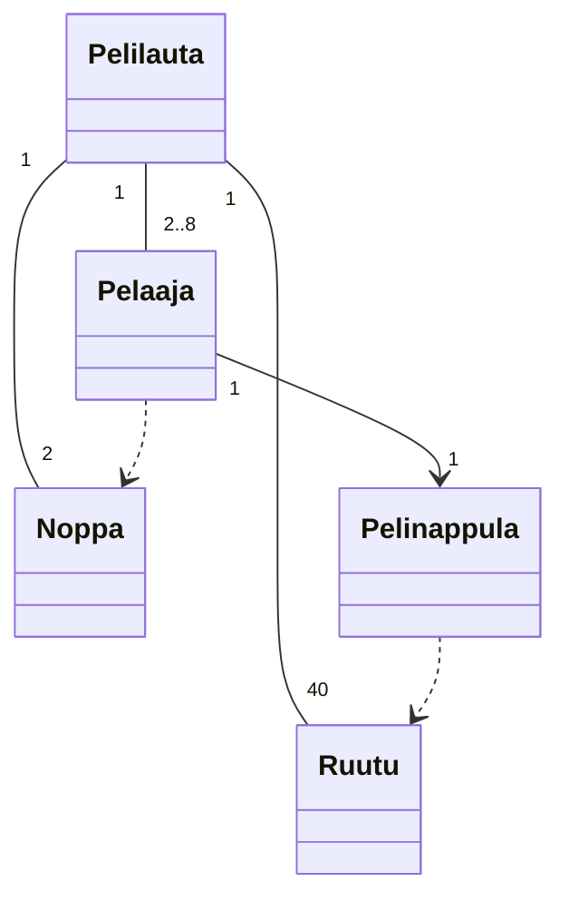

# Ohjelmistotekniikka

## Laskaritehtävät

### Viikko 1

[*komentorivi.__txt__*](https://github.com/RedFoxFinn/ot-harjoitustyo/blob/main/laskarit/viikko1/komentorivi.txt)

[*gitlog.__txt__*](https://github.com/RedFoxFinn/ot-harjoitustyo/blob/main/laskarit/viikko1/gitlog.txt)

### Viikko 2

[*coverage.__png__*](https://github.com/RedFoxFinn/ot-harjoitustyo/blob/main/laskarit/viikko2/coverage.png)

### Viikko 3

Monopoli

## Harjoitustyö

[Pantry *README.__md__*](https://github.com/RedFoxFinn/ot-harjoitustyo/blob/main/pantry/README.md)

[Vaatimusmäärittely](https://github.com/RedFoxFinn/ot-harjoitustyo/blob/main/pantry/documentation/software_requirements_specification.md)

[Työaikakirjanpito](https://github.com/RedFoxFinn/ot-harjoitustyo/blob/main/pantry/documentation/working_time.md)