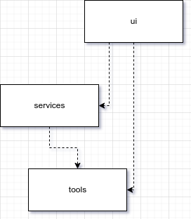

# Arkkitehtuurikuvaus

## Rakenne

Ohjelman rakenne noudattelee kaksitasoista kerrosarkkitehtuuria.

Koodin pakkausrakenne on seuraavanlainen:

Pakkaus _ui_ sisältää käyttöliittymänäkymistä, _services_ sovelluslogiikasta ja pysyväistallennuksesta vastaavan koodin. Lisäksi pakkaus _entities_ sisältää luokkia, jotka kuvaavat ja hyödyntävät sovelluksen käyttämien tietueiden sisältöä.

## Käyttöliittymä

Käyttöliittymä sisältää kaksi erillistä näkymää:

- sovelluksen käytössä olevien tietojen tilastotiedot   [valmis]
- uusien tuotteiden lisäys                              [valmis]

Lisäksi toteutettavat näkymät:

- sovelluksen käytössä olevien tietojen listaus         [todo]

Jokainen näkymä on toteutettu omana luokkanaan. Oletuksena sovellus avautuu tilastotietoja esittävään näkymään. Sovelluksen näkymistä näytetään kerrallaan vain yksi. Näkymien esittämisestä vastaa PantryUI-luokka. Käyttöliittymä on pyritty eristämään muusta sovelluslogiikasta omiksi yksiköikseen. Käyttöliittymäluokista kutsutaan services-hakemistoon eriytettyä DatabaseHandler-luokkaa ja sen metodeja, jotka toteuttavat tietokantatoiminnot SQLite-tietokantaan.

Käyttöliittymästä uusia tietoja lisätessä sovelluksen sisäinen tila tilastoissa ei muutu vaan se luodaan aina uudelleen, kun näkymää vaihdetaan tilastonäkymään. Tämä takaa sen, että tilasto on mahdollisimman hyvin ajantasalla. Lisäksi tuotteiden lisäyksestä vastaavassa näkymässä ei tuotteiden alatyyppien valinta ole käytettävissä eikä näkyvissä, mikäli tuotteen tyypiksi ei ole valittu "Raaka-aineet". Tämän tyypin valinnan ollessa aktiivinen, käyttöliittymästä valitaan myös alatyyppi. Tuotteen lisäyksessä tarvitaan seuraavia tietoja:

- Tuote(nimi) - tekstinä
- Tyyppi      - valinta pudotusvalikosta
- Säilyvyys   - päivän valinta kalenterista
- Lukumäärä   - lukuna
- Alatyyppi   - valinta pudotusvalikosta (vain tyypillä "Raaka-aineet")

## Sovelluslogiikka

## Tietojen pysyväistallennus

Sovelluksen tietojen pysyväistallennus on toteutettu paikallisesti SQL-tyyppisellä SQLite 3 -tietokannalla.

### Tietokannan rakenne

Seuraavassa esitellään käytettävän tietokannan rakenne.

#### Taulut

Sovelluksen käyttämässä SQLite 3-tietokannassa käytetään seuraavia tauluja tietojen säilyttämiseen:

- Products  | sisältää tuoterivit tuotteista, jotka on tietokantaan sovelluksen avulla syötetty
- Types     | sisältää tuotteille määritettävät tuotetyypit (Juomat, Ruoat, Raaka-aineet - id: 1,2,3)
- Subtypes  | sisältää tuotteille määritettävät alatyypit, joita käytetään tuotetyypillä 3, Raaka-aineet. oletuksena muutoin arvo on tuotteella 0

##### Products

Tuotteilla (Products) on seuraavat kentät:

- id (määritetään automaattisesti tuoteriviä talletettaessa)
- name (tuotteen nimike, merkkijono)
- type (tuotteen tyyppi, kokonaisluku, tyypin id vastaa tämän kentän arvoa)
- subtype (tuotteen alatyyppi, mikäli tyyppinä on 3 - Raaka-aineet, alatyypin id vastaa tämän kentän arvoa, oletusarvo 0)
- storage_life (tuotteen säilyvyysaika, kokonaisluku, epoch-aikaleima sekuntimuodossa)
- number_of (lukumäärä, tuotteiden määrä rivillä, kokonaisluku, oletuksena 1, arvo 0 ja alle ei sallittu)

##### Types

Tyypeillä (Types) on seuraavat kentät:

- id (määritellään automaattisesti riviä luodessa tietokannan alustuksen yhteydessä)
- type_name (tyypin nimi, merkkijono)

##### Subtypes

Alatyypeillä (Subtypes) on seuraavat kentät:

- id (määritellään automaattisesti riviä luodessa tietokannan alustuksen yhteydessä)
- subtype_name (alatyypin nimi, merkkijono)
- type (tyypin id, kokonaisluku, tyypin id vastaa tämän kentän arvoa)

## Päätoiminnallisuudet

Sovelluksen päätoiminnallisuudet sisältävät kolme toimintoa: Tilastointinäkymän, tietojen syöttämisen näkymän ja listanäkymän

### Tilastointinäkymä (stats)

Näkymässä näytetään sovellukseen talletettujen tietojen tilastointia seuraavasti:

- Tuotteita
  - Talletettujen tuoterivien määrä
- Tuotteet tyypeittäin
  - jako tyyppien mukaan (Juomat, Ruoat, Raaka-aineet)
  - jokaiselle tyypille näytetään talletettujen tuotteiden kokonaismäärä (ei rivimäärää)
- Pian vanhenevat tuotteet
  - kahden (2) päivän sisällä vanhenevien tuoterivien lukumäärä
  - kahden (2) päivän sisällä vanhenevien tuotteiden kokonaismäärä
- Vanhentuneet tuotteet
  - vanhentuneiden tuoterivien lukumäärä
  - vanhentuneiden tuotteiden kokonaismäärä

Lisäksi näkymässä on painike, jolla voidaan siirtyä lisäysnäkymään

### Lisäysnäkymä (add_product)

Näkymässä näytetään sovellukseen lisättävien tuotteiden lisäyslomake, jossa on seuraavat kentät:

- Tekstikenttä Tuote (tuotteen nimikkeen syöttö)
- Pudotusvalikko Tyyppi (tuotteen tyypin valinta)
- Päivävalitsin Säilyvyys (tuotteen säilyvyysajan valinta, parasta ennen / viimeinen käyttöpäivä)
- Numerokenttä Lukumäärä (tuotteiden määrän riville syöttö)
- Pudotusvalikko Alatyyppi (tuotteen alatyypin valinta, HUOM: käytössä ja esillä vain, jos tyypiksi on valittu 03 - Raaka-aineet)

Lisäksi näkymässä on painike, jolla voidaan siirtyä tilastointinäkymään