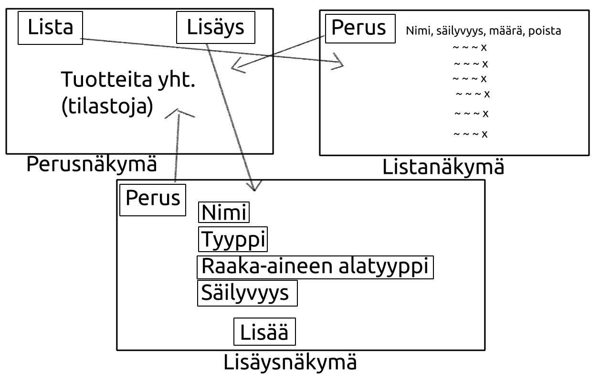

# Vaatimusmäärittely sovellukselle Pantry

## Sovelluksen tarkoitus

Sovelluksen tarkoitus on pitää ruokien, juomien ja raaka-aineiden inventaario helppolukuisessa ja päivitettävässä muodossa.

## Käyttäjät

Sovelluksessa käytetään vain yhtä käyttäjäroolia eli *normaalia käyttäjää*, koska se on suunniteltu toimimaan esimerkiksi kotitalouden inventaarion seurantaan.

## Sovelluksen tarjoamat toiminnallisuudet

Käyttöliittymä toteutetaan suomeksi.

### Sovelluksen käynnistys

Näytetään latausruutu.

### Sovelluksen käynnistyttyä

#### Tilastointinäkymä [tehty]

Sovelluksen käynnistyttyä avautuu perusnäkymäksi tilastointinäkymä, jossa näytetään inventaarion tilastointia.

#### Lisäysnäkymä [tehty]

Lisäysnäkymässä voidaan lisätä uusia tuotteita inventaarioon.

Tuotteelle lisätään tiedot:

- nimi
- tyyppi (ruoka, juoma, raaka-aine)
- jos raaka-aine: (hiilihydraatit, proteiinit, rasvat, säilykkeet, puolivalmiste, jauhot)
- säilyvyys

- lukumäärä (lisätty viikolla 3)

Puolivalmiste = ruokajauhe, juomajauhe, juomatiiviste tai "lisää vain vesi" -tyyppinen ruoka

#### Listanäkymä

Listanäkymässä näytetään tuotteet listalla säilyvyyden mukaan lyhimmän säilyvyyden omaavat ensimmäisinä ja toissijaisesti tuotteen nimikkeen mukaan aakkosellisesti järjestettynä. Tuotteita ei nykyisessä versiossa voida suodattaa. Tuoterivillä näytetään tuotteiden lukumäärä. Näkymästä voidaan poistaa tuotteita sekä lisätä tai vähentää lukumäärää voimassaolevilla tuotteilla.

## Jatkokehitysideat

Jatkokehityksessä voidaan toteuttaa mm:

- ilmoitukset vanhenevista tuotteista
- pilvitallennus
- jaettu inventaario
- käyttäjäroolit
- tuotteelle voidaan merkitä täydennystarve
- tuotteiden suodatus listausnäkymässä

## Sovelluksen rajoitteet

Sovelluksen toiminta taataan vain Linux- ja MacOS-järjestelmissä. Windowsissa toimintaa ei voida taata.

## Käyttöliittymäluonnos

# Software requirements specification for Pantry

## Purpose

Purpose for the application 'Pantry' is to keep inventory of food, drinks and ingredients in readable and easily updated form.

## Users

Application uses only one user role, *normal user*. It is designed to be used for example household inventory tracking.

## Provided functionalities

UI will be in Finnish.

### Start up

Show loading screen.

### After starting

#### Basic view

After starting application, show statistics of inventory.

#### Adding view

In the adding view user can add new products to the inventory.

Following information are required and associated to the product:

- name
- type (food, drink, ingredient)
- if ingredient: (carbs, proteins, fats, canned, convenience, flours)
- storage life

- number of (added on week 3)

#### List view

List products by their shelf life starting from shortest in list view and secondary sorting by their name. Products can not be sorted in this version of the software. Number of products on the entry are shown. Entry can be removed from the list view. The number of products on entry can be increased and decreased for products that are not expired in the list view.

## Ideas for further development

In later development phases these ideas could be implemented:

- english translations
- notifications of soon expiring products
- using cloud database
- shared inventory
- user roles
- request supplies for product
- filtering of the products in the list view

## Software limitations

Software functioning cannot be guaranteed in Windows systems. Only Linux and MacOS are guaranteed.

## UI mockup (in Finnish)

