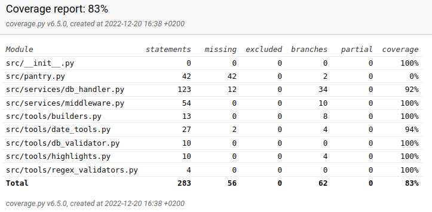

# Testausdokumentti

Ohjelmaa on testattu sekä automatisoiduin yksikkö- ja integraatiotestein käyttäen Python 3:n `unittest`-paketin toiminnallisuuksia sekä manuaalisesti tapahtunein järjestelmätason testein.

## Yksikkö- ja integraatiotestit

### Sovelluslogiikka

Sovelluslogiikasta vastaava `Middleware`-luokka testataan `Test_Middleware`-luokalla.

`Middleware`-luokka käyttää `DatabaseHandler`-luokkaa riippuvuutenaan ja se puolestaan testataan `Test_DatabaseHandler`-luokalla.

`DatabaseHandler`-luokan testauksessa käytetään pysyväistallennuksen testaamiseen `test_db.db`-tiedostoa, joka sisältää testien aikaisen SQLite3-tietokannan.

### Työkalufunktiot

Hakemistossa `src/tools` sijaitsee sovelluksen eri luokkien hyödyntämiä työkalufunktioita. Näille kaikille on omat vastaavat testiluokkansa.

### Testauskattavuus

Käyttöliittymäkerrosta lukuunottamatta sovelluksen testauksen haarautumakattavuus on __83%__.

Testauksen ulkopuolelle jäivät `pantry.py`-tiedoston luokka `PantryUI`, joka on koko sovelluksen käyttöliittymän juuriluokka, sekä eri käyttöliittymänäkymien luokat `AddProduct`, `ListProducts` ja `Stats`.

## Järjestelmätestaus

Sovelluksen järjestelmätestaus on suoritettu manuaalisesti.

### Asennus ja konfigurointi

Sovellus ei nykymuodossa tue konfiguraation muuttamista.

Sovellusta on testattu tilanteissa, joissa sen pysyväistallennukseen käyttämä tietokantatiedosto on valmiiksi ollut luotuna sekä tilanteissa, joissa sitä ei sovelluksen käynnistyessä vielä ole olemassa.

### Toiminnallisuudet

Kaikki määrittelydokumentin ja käyttöohjeen listaamat toiminnallisuudet on käyty läpi. Kaikki toiminnallisuudet on toteutettu siten, että tyhjiä arvoja ei hyväksytä syötteeksi. Poikkeuksena alkuperäisestä määrittelystä, tuotteiden suodatusta listausnäkymässä ei toteutettu vaan jätettiin myöhempään kehitykseen.

## Sovellukseen jääneet laatuongelmat

Sovellus ei nykymuodossaan anna virheilmoituksia kuin virheellisestä syötteestä tuotteen lisäyksen yhteydessä (epäkonsistentti).

