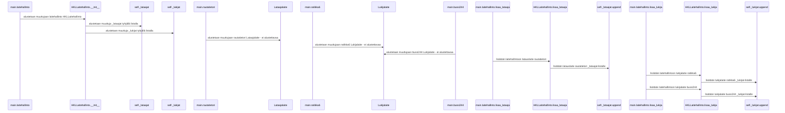

# HSL-matkakortti sekvenssikaaviona

```mermaid
  sequenceDiagram
    main.laitehallinto->>HKLLaitehallinto.__init__:alustetaan muuttujaan laitehallinto HKLLaitehallinto
    HKLLaitehallinto.__init__->>self._lataajat:alustetaan muuttuja _lataajat tyhjällä listalla
    HKLLaitehallinto.__init__->>self._lukijat:alustetaan muuttuja _lukijat tyhjällä listalla
    main.rautatietori->>Lataajalaite:alustetaan muuttujaan rautatietori Lataajalaite - ei alustettavaa
    main.ratikka6->>Lukijalaite:alustetaan muuttujaan ratikka6 Lukijalaite - ei alustettavaa
    main.bussi244->>Lukijalaite:alustetaan muuttujaan bussi244 Lukijalaite - ei alustettavaa
    main.laitehallinto.lisaa_lataaja->>HKLLaitehallinto.lisaa_lataaja:lisätään laitehallintoon latauslaite rautatietori
    HKLLaitehallinto.lisaa_lataaja->>self._lataajat.append:lisätään latauslaite rautatietori _lataajat-listalle
    main.laitehallinto.lisaa_lukija->>HKLLaitehallinto.lisaa_lukija:lisätään laitehallintoon lukijalaite ratikka6
    HKLLaitehallinto.lisaa_lukija->>self._lukijat.append:lisätään lukijalaite ratikka6 _lukijat-listalle
    main.laitehallinto.lisaa_lukija->>HKLLaitehallinto.lisaa_lukija:lisätään laitehallintoon lukijalaite bussi244
    HKLLaitehallinto.lisaa_lukija->>self._lukijat.append:lisätään lukijalaite bussi244 _lukijat-listalle
```