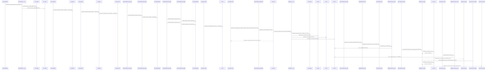

# HSL-matkakortti sekvenssikaaviona

```mermaid
  sequenceDiagram
    main.laitehallinto->>HKLLaitehallinto.__init__:alustetaan muuttujaan laitehallinto HKLLaitehallinto
    HKLLaitehallinto.__init__->>self._lataajat:alustetaan muuttuja _lataajat tyhjällä listalla
    HKLLaitehallinto.__init__->>self._lukijat:alustetaan muuttuja _lukijat tyhjällä listalla
    main.rautatietori->>Lataajalaite:alustetaan muuttujaan rautatietori Lataajalaite - ei alustettavaa
    main.ratikka6->>Lukijalaite:alustetaan muuttujaan ratikka6 Lukijalaite - ei alustettavaa
    main.bussi244->>Lukijalaite:alustetaan muuttujaan bussi244 Lukijalaite - ei alustettavaa
    main.laitehallinto.lisaa_lataaja->>HKLLaitehallinto.lisaa_lataaja:lisätään laitehallintoon latauslaite rautatietori
    HKLLaitehallinto.lisaa_lataaja->>self._lataajat.append:lisätään latauslaite rautatietori _lataajat-listalle
    main.laitehallinto.lisaa_lukija->>HKLLaitehallinto.lisaa_lukija:lisätään laitehallintoon lukijalaite ratikka6
    HKLLaitehallinto.lisaa_lukija->>self._lukijat.append:lisätään lukijalaite ratikka6 _lukijat-listalle
    main.laitehallinto.lisaa_lukija->>HKLLaitehallinto.lisaa_lukija:lisätään laitehallintoon lukijalaite bussi244
    HKLLaitehallinto.lisaa_lukija->>self._lukijat.append:lisätään lukijalaite bussi244 _lukijat-listalle
    main.lippu_luukku->>Kioski:alustetaan muuttujaan lippu_luukku Kioski - ei alustettavaa
    main.kallen_kortti->>lippu_luukku.osta_matkakortti:alustetaan muuttujaan kallen_kortti lippu_luukku:lta ostettava uusi matkakortti nimellä "Kalle"
    lippu_luukku.osta_matkakortti->>uusi_kortti:talletetaan uusi kortti muuttujaan uusi_kortti
    uusi_kortti->>Matkakortti.__init__:alustetaan muuttujaan uusi_kortti talletettava Matkakortti
    Matkakortti.__init__->>self.omistaja:talletetaan omistaja-muuttujaan omistajan nimi eli "Kalle"
    Matkakortti.__init__->>self.pvm:talletetaan pvm-muuttujaan oletusarvo 0
    Matkakortti.__init__->>self.kk:talletetaan kk-muuttujaan oletusarvo 0
    Matkakortti.__init__->>self.arvo:talletetaan arvo-muuttujaan oletusarvo 0
    uusi_kortti-->>main.kallen_kortti:tallennetaan muuttujaan kallen_kortti alustettu uusi_kortti
    main.rautatietori.lataa_arvoa->>Lataajalaite.lataa_arvoa:ladataan arvoa rautatietorin latauslaitteella kallen_kortti:in
    Lataajalaite.lataa_arvoa->>kortti.kasvata_arvoa:lataajalaite kasvattaa kortin arvoa annetun määrän (3)
    kortti.kasvata_arvoa->>Matkakortti.kasvata_arvoa:kortin kasvata_arvoa funktion kutsu
    Matkakortti.kasvata_arvoa->>self.arvo:arvo+= kasvatettava määrä (3)
    main.ratikka6.osta_lippu->>Lukijalaite.osta_lippu:osta ratikka6:sta lippu kallen_kortti:lla lipputyypillä 0 (RATIKKA)
    Lukijalaite.osta_lippu->>kortti.arvo:tarkistetaan, että kortilla on arvoa
    kortti.arvo-->>Lukijalaite.osta_lippu:kortin arvon määrä (3)
    kortti.vahenna_arvoa->Matkakortti.vahenna_arvoa:matkakortin funktio vahenna_arvoa
    Matkakortti.vahenna_arvoa->>self.arvo:arvo-= maara (matkan arvo, 1.5 RATIKKA)
    Lukijalaite.osta_lippu-->>ratikka6.osta_lippu:palauttaa arvon True, koska arvo (3) riitti lippuun (1.5)
    main.bussi244.osta_lippu->Lukijalaite.osta_lippu:osta bussi244:stä lippu kallen_kortti:lla lipputyypillä 2 (SEUTU)
    Lukijalaite.osta_lippu->>kortti.arvo:tarkistetaan, että kortilla on arvoa
    kortti.arvo-->>Lukijalaite.osta_lippu:kortin arvon määrä (1.5)
    Lukijalaite.osta_lippu-->>bussi244.osta_lippu:palauttaa arvon False, koska arvo (1.5) ei riitä lippuun (3.5)
```