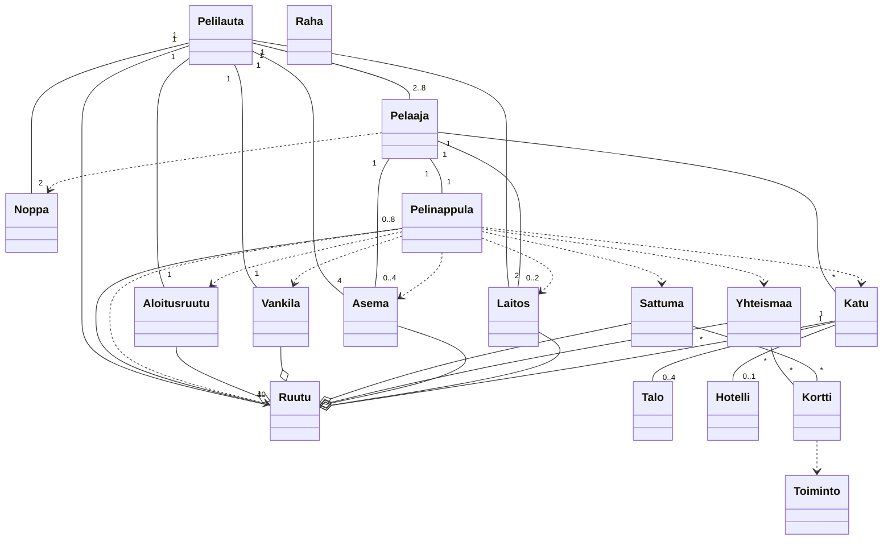

# Monopoli kaaviona

```mermaid
  classDiagram
    Pelilauta "1" -- "40" Ruutu
    Pelilauta "1" -- "2" Noppa
    Pelilauta "1" -- "2..8" Pelaaja
    Pelaaja "1" -- "1" Pelinappula
    Pelinappula "0..8" -- "1" Ruutu
    Pelinappula ..> Ruutu
    Pelaaja ..> Noppa
    Aloitusruutu --o Ruutu
    Vankila --o Ruutu
    Sattuma --o Ruutu
    Yhteismaa --o Ruutu
    Asema --o Ruutu
    Laitos --o Ruutu
    Katu --o Ruutu
    Pelilauta "1" -- "1" Aloitusruutu
    Pelilauta "1" -- "1" Vankila
    Pelilauta "1" -- "4" Asema
    Pelilauta "1" -- "2" Laitos
    Katu "1" -- "0..4" Talo
    Katu "1" -- "0..1" Hotelli
    Pelaaja "1" -- "*" Katu
    Pelaaja "1" -- "0..4" Asema
    Pelaaja "1" -- "0..2" Laitos
    Pelinappula ..> Vankila
    Pelinappula ..> Aloitusruutu
    Pelinappula ..> Katu
    Pelinappula ..> Asema
    Pelinappula ..> Laitos
    Pelinappula ..> Yhteismaa
    Pelinappula ..> Sattuma
    Yhteismaa "*" -- "*" Kortti
    Sattuma "*" -- "*" Kortti
    Kortti ..> Toiminto
    class Pelaaja
    class Pelilauta
    class Pelinappula
    class Noppa
    class Ruutu
    class Kortti
    class Toiminto
    class Sattuma
    class Yhteismaa
    class Asema
    class Laitos
    class Vankila
    class Aloitusruutu
    class Katu
    class Raha
    class Talo
    class Hotelli
```