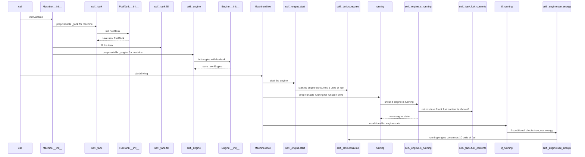

# Moottori - bensatankki sekvenssikaaviona

```mermaid
  sequenceDiagram
    call->>Machine.__init__:init Machine
    Machine.__init__->>self._tank:prep variable _tank for machine
    self._tank->>FuelTank.__init__:init FuelTank
    FuelTank.__init__-->>self._tank:save new FuelTank
    Machine.__init__->>self._tank.fill:fill the tank
    Machine.__init__->>self._engine:prep variable _engine for machine
    self._engine->>Engine.__init__:init engine with fueltank
    Engine.__init__-->>self._engine:save new Engine
    call->>Machine.drive:start driving
    Machine.drive->>self._engine.start:start the engine
    self._engine.start->>self._tank.consume:starting engine consumes 5 units of fuel
    Machine.drive->>running:prep variable running for function drive
    running->>self._engine.is_running:check if engine is running
    self._engine.is_running->>self._tank.fuel_contents:returns true if tank fuel content is above 0
    self._engine.is_running-->>running:save engine state
    Machine.drive->>if_running:conditional for engine state
    if_running->>self._engine.use_energy:if conditional checks true, use energy
    self._engine.use_energy->>self._tank.consume:running engine consumes 10 units of fuel
```